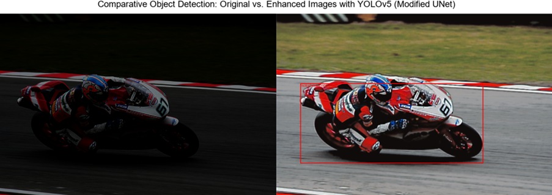
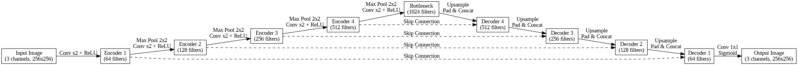
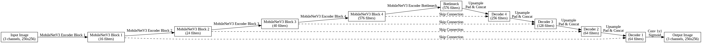

# Enhancing Object Detection in Low-Light Conditions Using Deep Learning

## Overview

This project focuses on developing a deep learning-based solution to enhance object detection in low-light conditions. Our approach involves a two-step process: enhancing low-light images using advanced image enhancement techniques, and adapting object detection models to these enhanced images.

We implemented and evaluated three different image enhancement networks:
1. A modified UNet (`UNetv2_model.py`)
2. A MobileNetV3 Small-based network (`mobile_model.py`)
3. A MobileNetV3 Large-based network (`mobie_model_big.py`)

The enhanced images were then fed into a YOLOv5 object detection model to evaluate the performance improvements.



## Repository Structure

## Repository Structure

- **`test_img/`**: Contains test images for evaluation.
- **`visualize_models/`**: Scripts for visualizing model outputs.
- **`visualize_models_results/`**: Contains the results of the visualization scripts.
- **`results/`**: Includes example outputs from the models.
- **`UNetv2_model.py`**: Implementation of the modified UNet.
- **`coco.names`**: Names of the COCO dataset classes.
- **`mobie_model_big.py`**: Implementation of the MobileNetV3 Large-based network.
- **`mobile_model.py`**: Implementation of the MobileNetV3 Small-based network.
- **`requirements.txt`**: List of required Python packages.
- **`setup_yolov4.py`**: Script to setup YOLO (if needed).
- **`test_model_UNetv2.py`**: Script to test the modified UNet model.
- **`test_model_mobile.py`**: Script to test the MobileNetV3 Small-based network.
- **`test_model_mobile_big.py`**: Script to test the MobileNetV3 Large-based network.
- **`test_yolo.py`**: Script to test the YOLO model.
- **`train_model_Mobile.py`**: Script to train the MobileNetV3 Small-based network.
- **`train_model_UNetv2.py`**: Script to train the modified UNet model.
- **`train_model_mobile_big.py`**: Script to train the MobileNetV3 Large-based network.
- **`yolov5s.pt`**: Pre-trained YOLOv5 model weights.


## Getting Started

### Prerequisites

Ensure you have Python and pip installed. You can install the required packages using:
```bash
pip install -r requirements.txt

### Training the Models

1. **Modified UNet**:
   ```bash
   python train_model_UNetv2.py

2. **MobileNetV3 Small-based Network:**:
   ```bash
   python train_model_Mobile.py

3. **Modified UNet**:
   ```bash
   python train_model_mobile_big.py


### Testing the Models

1. **Modified UNet**:
   ```bash
   python test_model_UNetv2.py

2. **MobileNetV3 Small-based Network:**:
   ```bash
   python test_model_Mobile.py

3. **Modified UNet**:
   ```bash
   python test_model_mobile_big.py
   

### Object Detection with YOLOv5

To test the object detection on enhanced images:
```bash
python test_yolo.py

```

## Methods

### Modified UNet

The UNet architecture, originally designed for biomedical image segmentation, is well-suited for image enhancement due to its encoder-decoder structure, which captures multi-scale features and recombines them to produce high-quality outputs.

**Architecture:**



**Implementation:** The modified UNet implementation details can be found in the `UNetv2_model.py` file in the repository.

### MobileNetV3 Small-based Network

MobileNetV3 Small is designed for efficient computation, making it suitable for real-time applications. We adapted it into a UNet-like architecture to leverage its lightweight encoder features for image enhancement.

**Architecture:**



**Implementation:** The details of the MobileNetV3 Small-based network can be found in the `mobile_model.py` file in the repository.

### MobileNetV3 Large-based Network

MobileNetV3 Large is a more robust model compared to the Small variant, providing higher accuracy with a slight increase in computational complexity. We adapted it similarly to the MobileNetV3 Small-based network.

**Architecture:**


**Implementation:** The details of the MobileNetV3 Large-based network can be found in the `mobie_model_big.py` file in the repository.


## Results

The performance of the models was evaluated using PSNR, SSIM for image quality, and mAP for object detection accuracy. Here are some sample results:

- **Modified UNet**:
  - Avg PSNR: 17.04
  - Avg SSIM: 0.74

- **MobileNetV3 Small-based Network**:
  - Avg PSNR: 18.43
  - Avg SSIM: 0.72

- **MobileNetV3 Large-based Network**:
  - Avg PSNR: 30.22
  - Avg SSIM: 0.90

## Visualization

The `visualize_models` directory contains scripts to visualize the outputs of the models. You can use these scripts to generate and compare the results.

## Contributing

If you would like to contribute to this project, please fork the repository and use a feature branch. Pull requests are welcome.

## License

This project is licensed under the MIT License. See the `LICENSE` file for more details.

## Acknowledgements

- The ExDark dataset by Loh and Chan
- The LoL dataset by Chen et al.
- The YOLOv5 model by Ultralytics
